BAGIAN 1 : MEMBUAT API MENGGUNAKAN NODE.JS

1. Install Node.js dan express
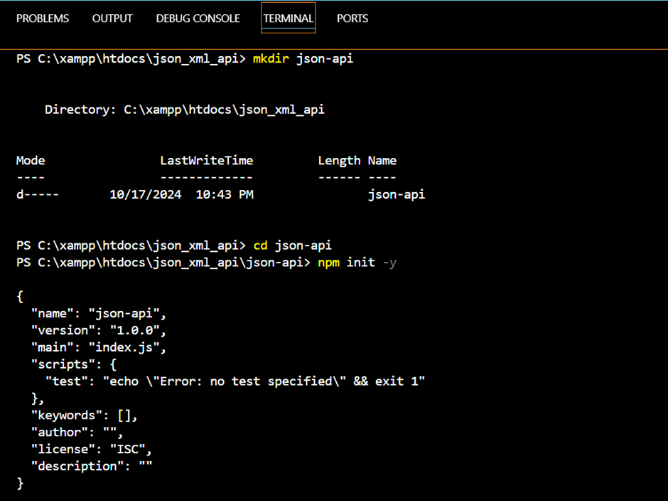
Install Express
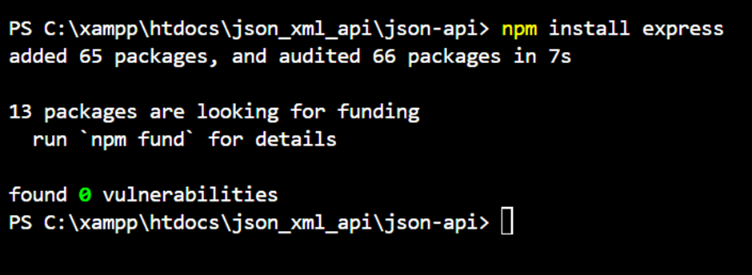

2. Membuat server express.js
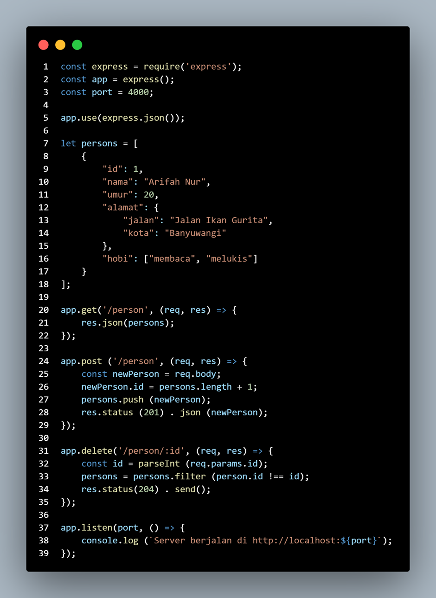

3. Menjalankan Server
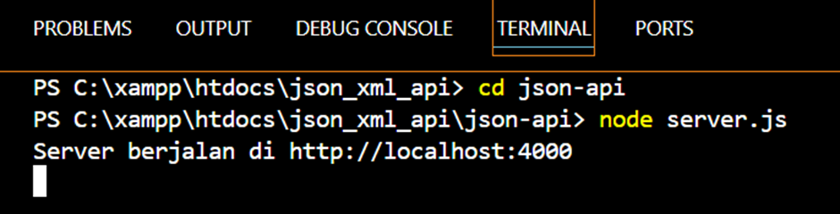

4. Mengakses API
GET
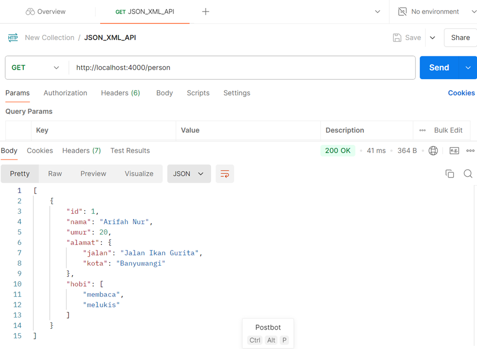
POST
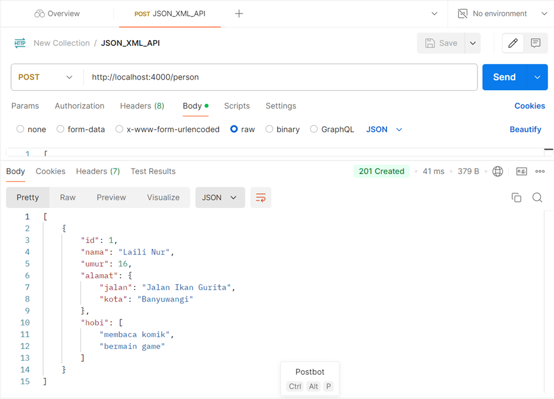
DELETE
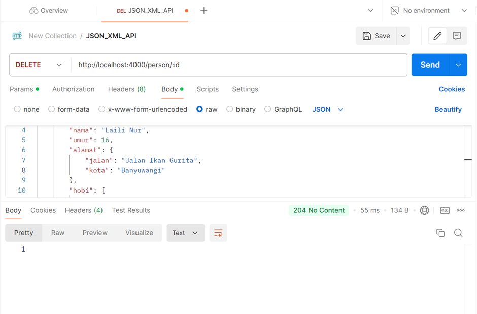

BAGIAN 2 : MEMBUAT API MENGGUNAKAN PHP

1. Membuat file API
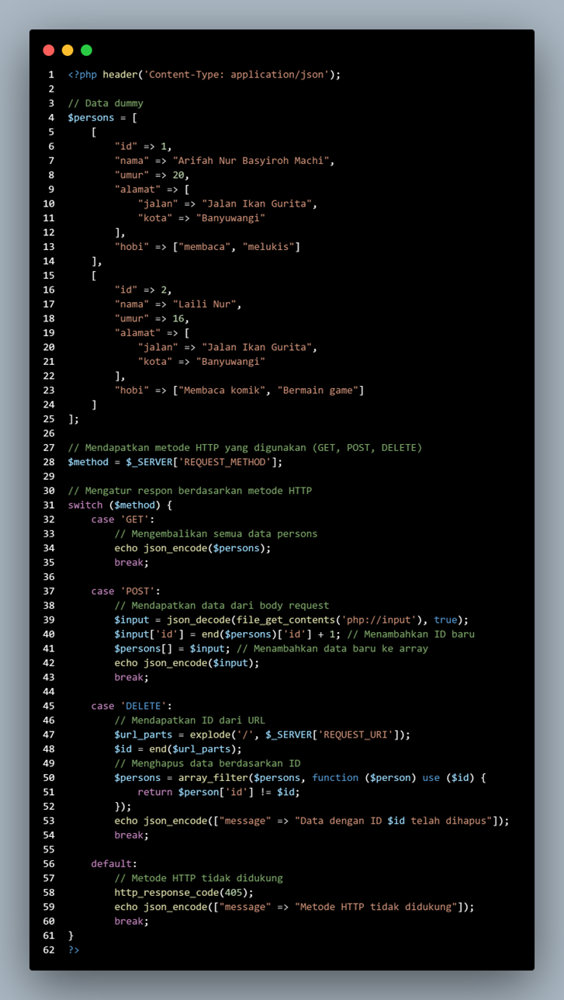

2. Menjalankan server
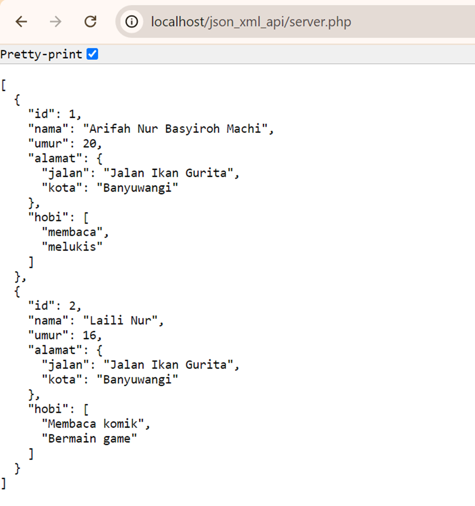

BAGIAN 3 : MEMBUAT API DENGAN XML MENGGUNAKAN PHP

1. Membuat Endpoint XML
 

2. Menjalankan server
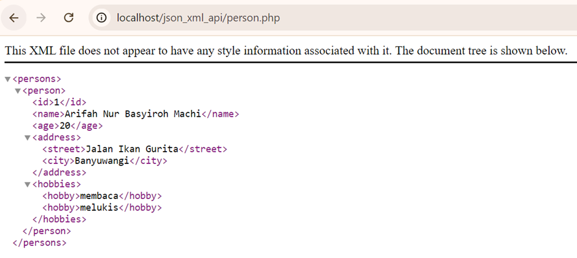

TUGAS
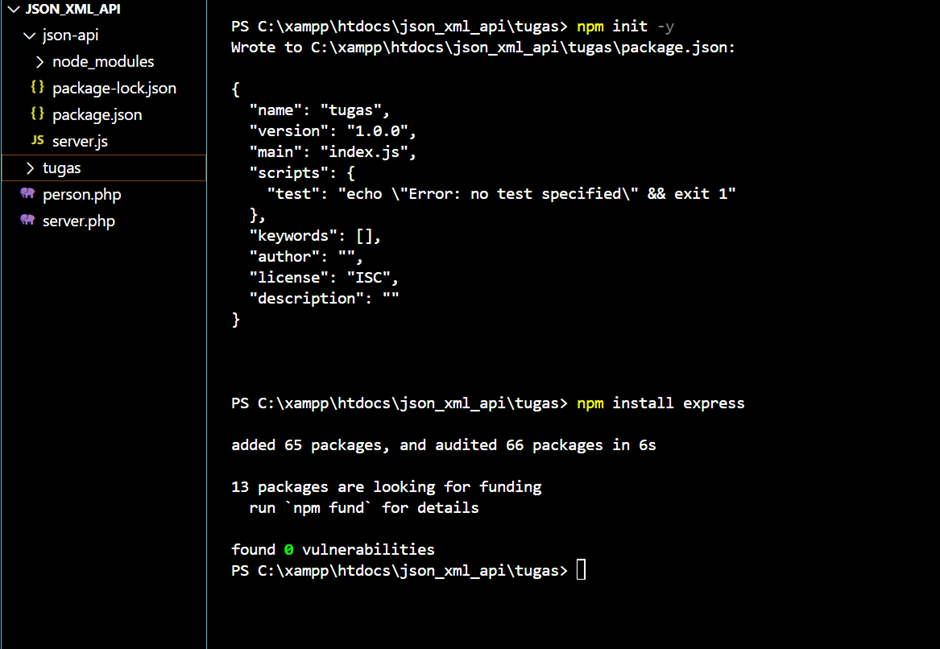
Membuat file API daftar buku
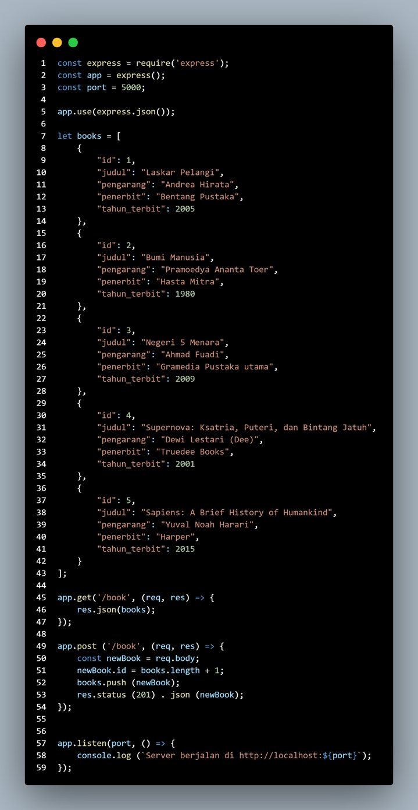
Membuat endpoint GET
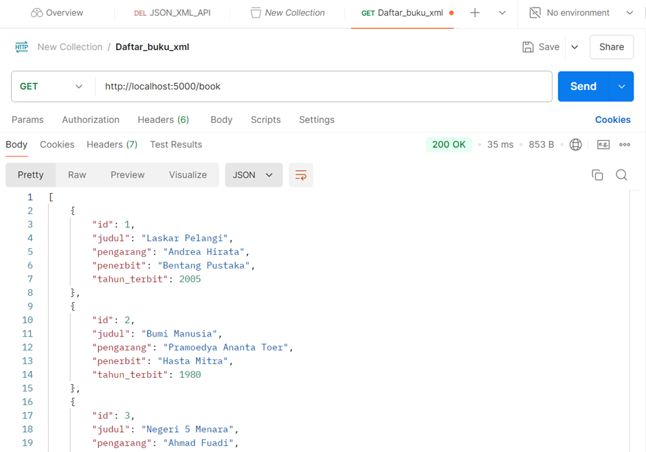
Membuat endpoint POST
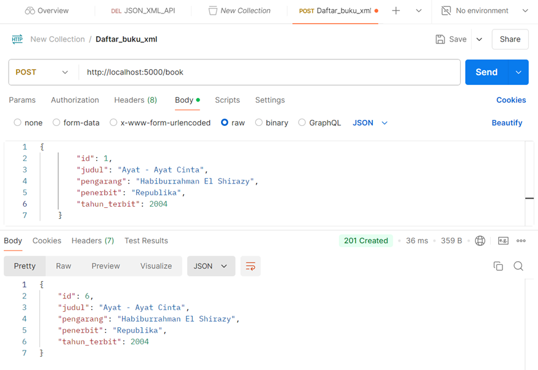 
Membuat endpoint XML
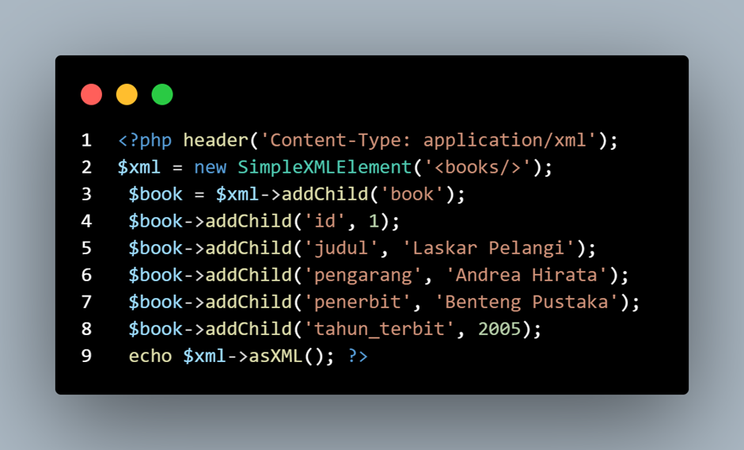
Hasil
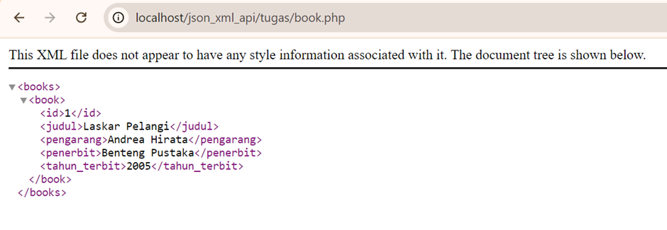